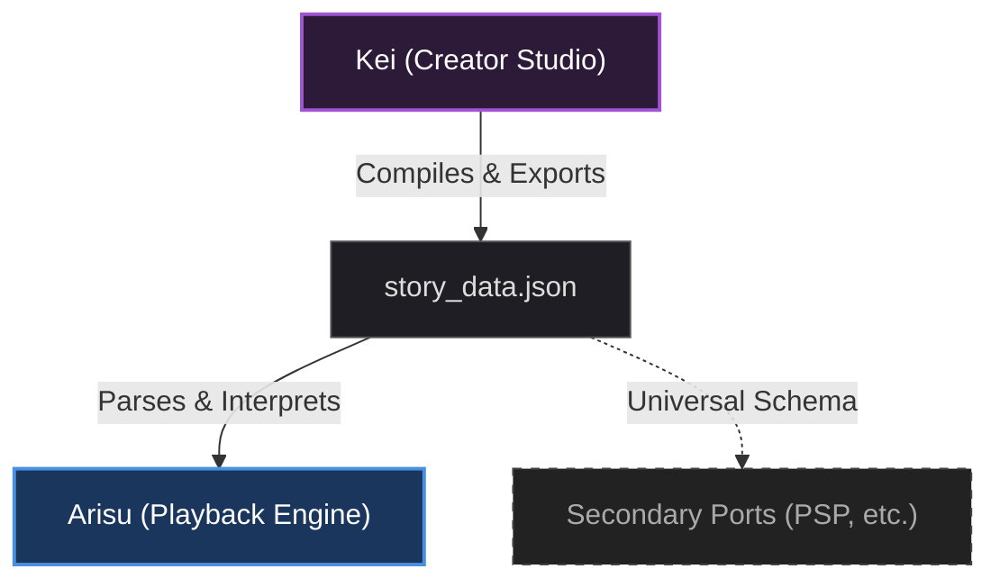

# Tendou

Tendou is a cross-platform visual novel development toolset. Production utilizing Tendou is split into two applications, **Kei**, which is a desktop application that functions as a creation studio, and **Arisu**, which functions as a json parsing runtime playback engine.

As the focus of this project is cross-platform implementation, a hard architectural boundary was set between the creation tool and the playback engine, allowing ports of the playback engine to easily be developed and work with previously created titles.

---

## Kei - Visual Novel Creation Studio

Kei is the development environment built with C# and Avalonia UI. She serves as the organizer and is where you'll write script dialogue, assign files and assets to scenes, handle audio, and manage character layouts in scenes. With Avalonia, she handles creation across standard operating systems `Windows, Linux, MacOS` beautifully. 

